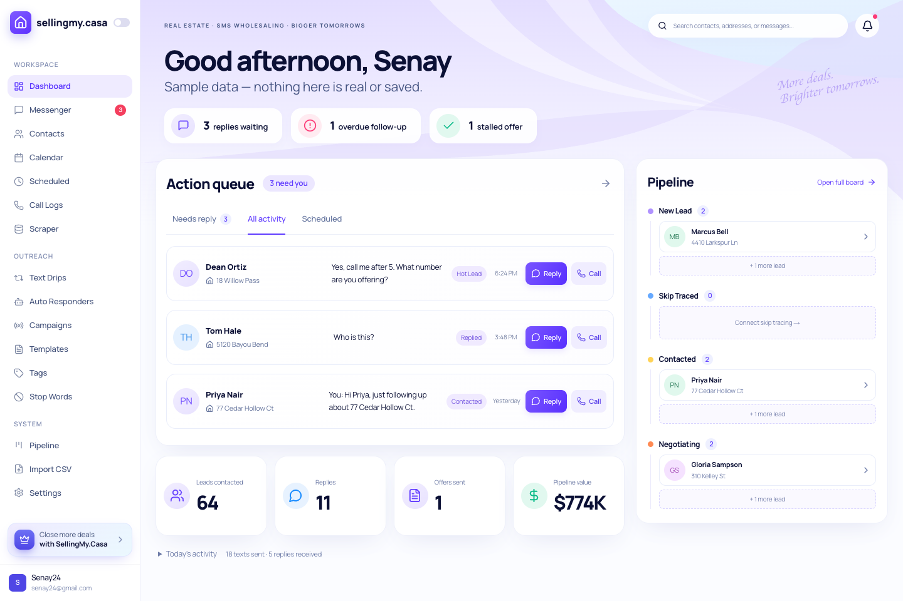

# Inbox-first dashboard visual review

The light-mode dashboard now places Action queue in 65% of the desktop content width, with the existing four pipeline stages in a vertical summary beside it. Four supporting metrics sit below the queue. The previous dashboard remains the dark-mode presentation.

This screenshot is a local isolated Next.js preview of the production components using `makeDemoDashboard`. It is not an authenticated production-data capture. No preview route, authentication bypass, fixture changes, or fabricated records are included in this change.

## Verification

- TypeScript: `npm run typecheck` passes.
- Production build: `npm run build` passes. Existing dynamic-rendering diagnostics for `/leads` and `/import` remain; both are emitted as dynamic routes.
- Browser: checked 1440×960 desktop, 1024px, 768px, and 390px widths, with no document overflow or browser runtime exceptions.
- Checked Needs reply / All activity filters, existing Scheduled destination, Reply destination, phone links, mobile drawer / Escape, and empty states.
- Measured desktop columns: queue 747.5px; pipeline 402.5px (65% / 35% excluding the gutter).
- Captured desktop, mobile, and empty states and reviewed the desktop side-by-side against the supplied reference.

## Deliberate differences from the reference

- All existing sidebar destinations remain, including items absent from the reference.
- The app's four real pipeline stages remain; no fifth stage is invented.
- KPIs use existing totals. No trend percentages or sparklines are fabricated.
- Search is a disabled presentation-only field. The bell opens the existing Messenger; Scheduled opens the existing Scheduled route.
- Addresses and statuses use already-loaded lead records when available. Overdue notices use existing at-risk records. No dashboard queries, data models, authentication, APIs, or Supabase/Telnyx wiring change.
- Greeting and user name remain dynamic. Sample mode retains its visible disclaimer.

Authenticated `/dashboard` visual verification with the owner's local Supabase environment remains outstanding.
